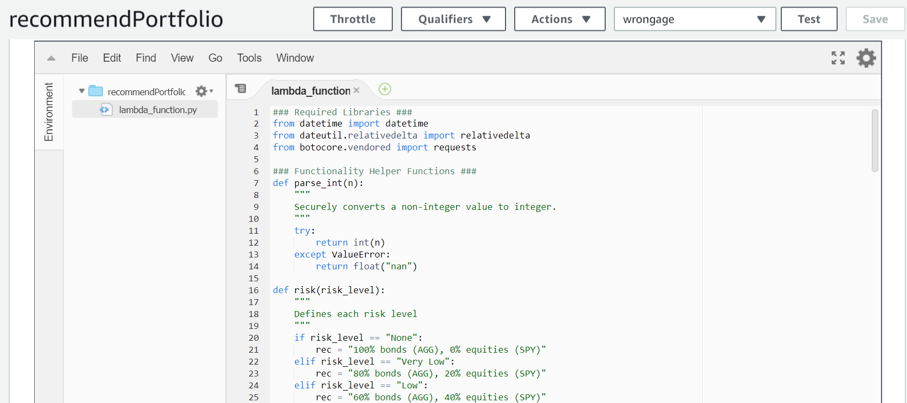

# Robo Advisor for Retirement Plans

In this assignment, a Robo Advisor was created using Amazon Web Services (AWS) and `Python`, to recommend an asset allocation for a retirement plan. The Robo Advisor was published and deployed on Slack as an app for users to access. 

1. [Initial Robo Advisor Configuration](Initial-Robo-Advisor-Configuration)

2. [Build and Test the Robo Advisor](Build-and-Test-the-Robo-Advisor)

3. [Deploy the Robo Advisor on Slack](Deploy-the-Robo-Advisor-on-Slack) 

4. [Enhance the Robo Advisor with an Amazon Lambda Function](Enhance-the-Robo-Advisor-with-an-Amazon-Lambda-Function)

5. [Robo Advisor in Action!](Robo-Advisor-in-Action!)

### Initial Robo Advisor Configuration

  An [Amazon Lex Bot](https://us-west-2.console.aws.amazon.com/lex/home?region=us-west-2) was created with a single intent named RecommendPortfolio to establish a conversation about the requirement inputs needed to suggest an asset allocation mix. 
  
  The utterances and slots were established, and one customized slot called `riskLevel` that will prompt with risk options as buttons for the user to select. 
  
          

  
### Build and Test the Robo Advisor

The Robo Advisor was built and tested in AWS to ensure accurate responses with the user. 

  
### Deploy the Robo Advisor on Slack: 
 
  The bot was published and deployed as a Robo Advisor Slack app. 
  
  
  
  
 
###  Enhance the Robo Advisor with an Amazon Lambda Function

AWS Lambda is a service that runs and executes customized code. A Lambda function was created in Python and added to the bot. The code validated the user's input and executed the logic for asset allocation recommendations.  This step also included testing the function and integating with the bot. 
  
  
  
  ## Robo Advisor in Action! 

